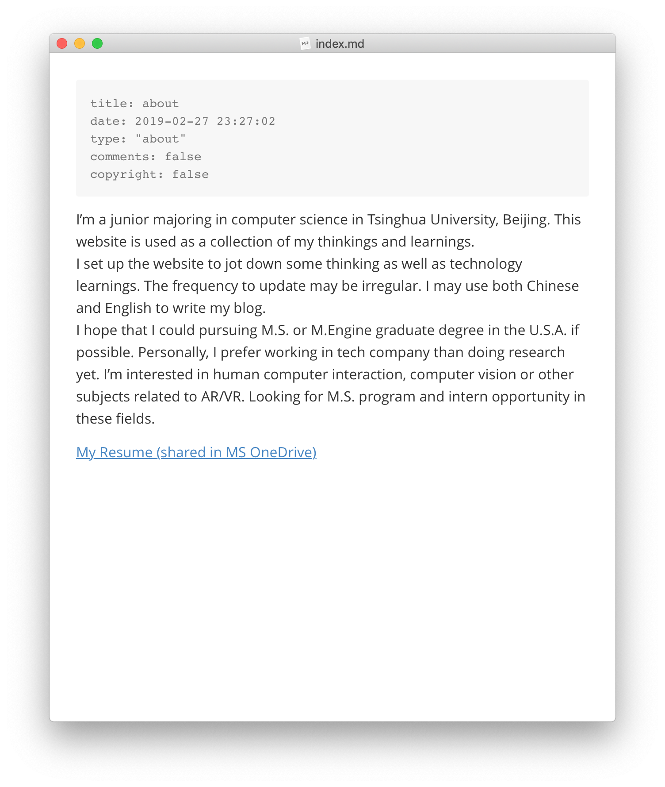
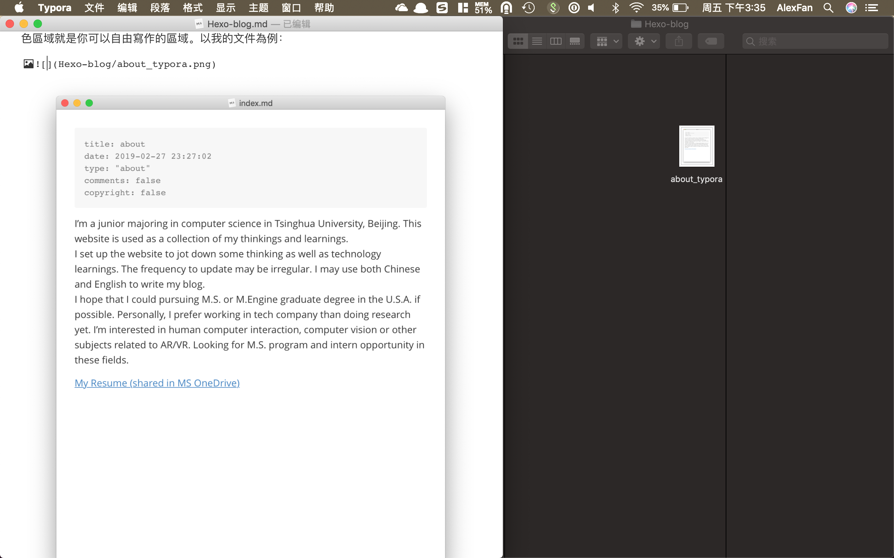

# 前言:

在許久之前就有架設個人網站的想法，一來作為博客，二來主要可以作為可以鏈接過來的線上CV，對CV上篇幅不及的個人項目做較為詳細的整理。之前嘗試過WordPress，然而免費版的WordPress.com有廣告而且對Markdown不是很友好，若自己搞服務器又挺麻煩，而且還有租服務器和域名的錢。

作為一個懶且沒錢但又不希望博客太難看的程序員，我驚喜地發現還真有一個免費、優雅、簡單的方案，就是我在這篇文章將要介紹的[Hexo](https://hexo.io/zh-tw/)。過程涉及了一些聽起來有點Geek的工具，但實際上整套跑下來無需編程知識也可以快速的完成，如果你的電腦里早就有這些開發環境的話那更是只有幾行指令的事。

不過需要注意的是，Hexo是一個靜態博客解決方案，和基於PhP的WordPress本質上是不同的，交互性不如後者。所以如果只是和我一樣想搞個主頁寫寫博客的話，Hexo可以很好地勝任，但想搭建功能複雜的網站乃至WebApp之類的還是採用動態網站較好。

# 相關環境配置:

以下將說明如何安裝、部署Hexo博客，以我的網站為例，從域名（注：網址欄中的alexfxw.github.io）可以很直觀地看出這個網站和Github有關。實際上，Hexo正是使用Github的靜態網頁託管功能來儲存渲染好的HTML，這也是為什麼需要一個Github賬戶的原因。雖然是託管在Github上面，但是如果想用自己的域名呢（例如 alexfxw.com 之類的），也不需要重新搬到新網站上做大改動可以簡單地修改。

> 已經有git, nodejs, npm的程序員就直接看hexo吧，然后以下假定你是MacOS 或是Linux系使用者，如果是Windows使用者的話，命令的輸入那些用Git Bash或Linux子系統的bash吧。

## Git/Github

直接去[Git的官網](https://git-scm.com/)下載自己平台相應的安裝包即可，然後如果沒有Github賬戶的人去[Github官網](https://github.com/)註冊一個就行。

初次啟動Git bash的人需要設定一下兩個全局變量和ssh。

```bash
git config --global user.name "你的GitHub用户名"
git config --global user.email "你的GitHub註冊郵箱"
ssh-keygen -t rsa -C "你的GitHub註冊郵箱"
```

把生成的.ssh文件夾（可以用`ls ./.ssh/`查看）裡面的id_rsa.pub秘鑰的內容全部複製，到[Github秘鑰設定](https://github.com/settings/keys)這裡建立一個新的SSH Key，隨意標題，內容放到Key欄里后儲存，之後你的電腦不用每次輸入密碼也可以合法地朝Github推送內容。

## NodeJS/NPM

NodeJS 是一個JavaScript的本地運行方案，基本是前端開發必備的工具包，沒有的話直接去[NodeJS官網](https://nodejs.org/en/)找一個LTS（長期支持版）的版本安裝即可。

由於JavaScript靈活的可擴展性，發佈/使用不同功能的模塊都十分容易，其中NPM是最為活躍的社群，也是國際上最為流行的Node模塊管理工具。现在的NodeJS已經集成了NPM，所以無需另外安裝。

## 如何在本地安裝Hexo

Hexo的代碼已經包裝成npm的模塊了，所以只需要一行優雅的代碼就可以在全局装上了。

```bash
npm install hexo-cli -g
```

切到你想要的目錄后，初始化博客的環境只需要以下幾行指令（假設創建的資料夾叫做blog）

```bash
hexo init blog
cd blog
npm install
hexo server
```

然後就好了，用瀏覽器打開`localhost:4000`（默認的端口4000，也可以自訂）可以看到hello world的美麗頁面（感謝NodeJS）。

## 如何把Hexo部署到網路上

### github.io

當然，搞了一個美麗的博客不會是僅為了在本機看了開心。接下來我們要利用Github的靜態頁面託管服務來把我們的博客推到網上，首先，在你的Github賬戶裡面新建一個Repo（代碼庫），名字建議叫做`xxxx.github.io`，其中xxxx是你的Github用戶名，新增完後不需要Initialize with a README或啥的，就放著。

### 生成/推送本地內容

現在我們要修改hexo的配置，這是我們第一次提到`_config.yml`這個重要的文件，往後的各種配置都和他脫不了關係。在這個文件裡面找到`deploy:` 的配置區，然後修改如下后保存。（此處順便強力推銷一下[vim編輯器](https://www.vim.org/)）

```yml
deploy:
   type: git
   repository: https://github.com/xxxx/xxxx.github.io.git
   branch: master
```

> xxxx 是你的github用户名，你此時應該已經建好了這個庫。

修改后輸入以下指令即可將內容推送到網站上，等一陣子后Github會在`xxxx.github.io`這個域名渲染好你的博客，在瀏覽器輸入你的域名應該就能看到了。

```bash
hexo g
hexo d
```

> g: generate / d: deploy，Hexo當然支持這種簡寫。

# Hexo 的個性化配置

好了，現在我們已經在網路上有一個自己的博客了，接下來談談個性化。個性化和兩個文件直接相關：

1. **網站配置文件**：`_config.yml`，和整個網站的配置有關。
2. **主題配置文件**：`themes/xxx/_config.yml`，和該主題的渲染方式有關。

行文里或以這兩種方式指代對應文件。

## 語言與地區

在**網站配置文件**里可以修改語言和地區，地區默認和電腦時區一致，語言默認英文。若要修改為繁體中文，使用`language: zh-TW`即可。更多的設置請參照官方網站，需注意由於Hexo內核自身的問題以及Next並未提供良好的支持，多語言站點的設置有點麻煩，如果有多語言需求可以參考[這篇博客](https://dengcb.com/zh/hexo-minos-multi-language/)使用Minos主題。

> 此處的語言配置僅和側邊欄等有關，和貼文能用的語言沒有關係。

## 更換主題

Hexo 支持許多主題，可以上[官網的主題推薦](https://hexo.io/themes/)查看。我自己用的是一個很有名的主題[Next](http://theme-next.iissnan.com/)，也就是你現在看到的我的主頁的這個效果。以下提供安裝方法：

> 注：我安裝的是5.x 的latest release version，據說有6.x了，也可以從那兒下載。

### 命令行安裝

```bash
cd /path/to/your/blog
mkdir themes/next
curl -s https://api.github.com/repos/iissnan/hexo-theme-next/releases/latest | grep tarball_url | cut -d '"' -f 4 | wget -i - -O- | tar -zx -C themes/next --strip-components=1
```

### 直接下載

不能用curl的人就到[這裡](https://github.com/iissnan/hexo-theme-next/releases/tag/v5.1.4)載吧（Windows的用戶之類的。。。）解壓后丟到themes資料夾就行。

### 設定主題

在配置文件`_config.yml`裡面找到`theme: `，修改為`theme: next`之后重新生成、部署即可。這裡特別提一下，Next是一個非常良心的主題（難怪一萬多Star），5.x版的Next下有三個Scheme，默認用的是大量留白的Muse，我的主頁用的是Pisces，可以自己切换、渲染看看。修改方法在`themes/next/_config.yml`里（對，這就是主題的配置文件），以改成Pisces為例：

```yaml
scheme: pisces
```

## 頭像設置

在主頁左下角可以看到自己設置的照片（對，那是我和女朋友的合照），設置方法是`themes/next/_config.yml`里的`avatar: `。建議在blog下的source資料夾里新建一個叫uploads的資料夾，然後把頭像放在裡面，假設叫做we.jpg的話，那麼你在next的設置文件里可以這樣設置頭像：

```yaml
avatar: /uploads/we.jpg 
```

## About/Tags/Categories

首先在**網站配置文件**中將以下部分里想要的欄位的注釋取消，例如我的配置如下：

```yaml
menu:
  home: / || home
  about: /about/ || user
  tags: /tags/ || tags
  categories: /categories/ || th
  archives: /archives/ || archive
```

新增的頁面透過以下指令建立（以about頁面為例）

```bash
hexo new page "about"
```

之後開啟其生成的`source/about/index.md`文件可以做進一步的修改，對于Markdown文件，推薦使用[Typora](https://typora.io/)打開，一個我到現在覺得最好用的Markdown編輯器（他也是提交實驗報告利器，相信我）。用typora開啟后，在最上方的灰色區域里加上`type: "about"`，下面的白色區域就是你可以自由寫作的區域。以我的文件為例：



完成了修改主題配置文件、新增page兩個操作，你點擊你主頁的about應該就會跳轉了。tag、categories類似但不需要寫內文。

## Next 支持的個人化配置

Next 作為熱門主題，還支持了許多實用的功能，下面是我有用的幾個。

### 社交網路

在**主題配置文件**下查找`social: `，把自己想要添加的項目前的注釋符`#`去除，然後鏈接填上自己的即可，程序員推薦鏈接一下Github。

### 打賞

知識付費興起，在**主題配置文件**里找到`reward:`，可以添加自己的微信/支付寶/Bitcoin付款碼，其他支付的也行，只是我沒試過下標能不能改。

> 我也放了我的打賞鏈接，但是我估計也不會有人打賞/看的人都沒有微信支付寶所以我也只是說說，總之效果拉到頁面底部即可。

### 著作權信息

在**主題配置文件**裡面找到`post_copyright`，把enabled改成true然後下面選取你打算使用什麼著作權標準，可以自己看看各個CC標準的區別，不多做敘述，預設顯示效果參照本貼文底部，應該是會隨著站點的默認語言改變的。

# 如何新增貼文

## 多媒體資源

先說明，由於Github託管和Markdown渲染的局限性，貼文里直接支持的多媒體形式其實只有圖片，對影片和音樂有需求的可以自己Google（因為我目前還沒有這個需求所以我現在也不知道，好像是有插件吧）。

圖片的話原生的管理方式不外乎就是把照片丟到`source/uploads/`裡面，然後通過這個路徑引用——Markdown管理圖片的方式就是路徑，不過別按照GUI的指示弄成本機的絕對路徑了，網頁渲染不出來的。

推薦一個比較方便圖片管理插件，在新增貼文的md檔時會同時生成一個同名的資料夾，把圖片丟到裡面引用就行。安裝方式如下（在blog的根目錄輸入命令）：

```bash
npm install hexo-asset-image --save
```

假設貼文的文件是hello.md，然後要插入的圖片a.jpg已經放到了hello資料夾下，則在markdown文件里可以這樣插入圖片：

```markdown

```

實際運行起來像這樣。



## 新增貼文

```bash
hexo new post "Hello-world"
```

這個指令會在`source/_posts/`資料夾下生成一個叫做Hello-world.md的檔案，文章標題默認和檔案名稱一致，打開該Markdown文件可以修改標題。

內文就是Markdown該怎麼寫就怎麼寫，沒什麼好說的。值得一提的是，在頂部的設定區可以設定標籤和類別，例如：

```markdown
title: Hello, the world
tags:  [A, B]
categories: 'Awesome'
```

將會給這篇文章加上標籤A、B，并歸類到Awesome這個類別。

以上這些知識應該足夠從無到有建立一篇像是[我的博客](https://alexfxw.github.io/)一樣的個人網站了，一些關於JavaScript自定義腳本或是Sitemap的編寫等進階技巧雖然也挺重要，但是加上了就很難再說是「超簡易教學」了，所以就這樣啦。總之希望有所幫助，會不會有更多的更新或內容就取決於我之後的熱情持續度以及忙碌程度了。。。

