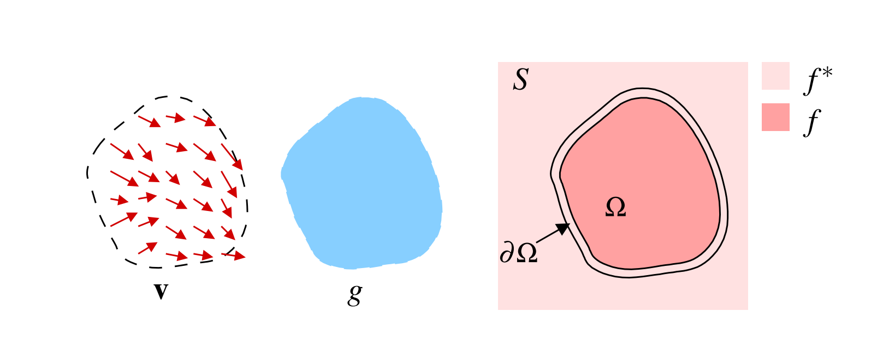
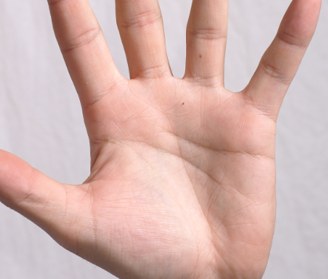
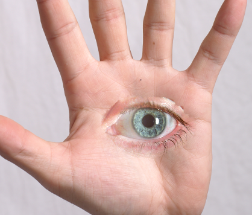

> 相关论文: Perez, P., Gangnet, M., & Blake, A. (2003). Poisson Image Editing. ACM SIGGRAPH 2003.

## 介绍

图像融合是相当常见的图像处理场景，例如很多普通用户打开PS的主要目的就是图像合成。图像融合的效果可以从两个方向来评价：

1. 边界的标记难度
2. 合成结果的效果

以Photoshop进行工作为例，把两个不同的图片拼接在一起时我们往往会用Brush对边界的像素进行处理，在Smart Brush出现之前这个工作其实相当繁琐，且边界的过渡有时会不太自然。比较原始的方法例如暴力cut and paste和alpha融合都要求精准的抠图，结果也差强人意。

因此这里将介绍2003 年时Blake等人提出的方法——泊松图像编辑（Poisson Image Editing）如何运用图片的梯度信息优化了这两个问题，而现在的Adobe Photoshop也应用了基于泊松图像编辑的改良算法来处理图像合成问题。

## 原理

科学家发现人类的视觉对局部对比度变化的敏感度远高于对整体亮度变化的敏感度，因此我们可以让两幅图像在融合边界处完全一致，但在保持区域内部的梯度调整图像整体的亮度/颜色。为了完成这件事，首先我们得要描述”边界“，以下给出论文中对边界的定义：



> 由于MathJax渲染行间公式的某种神秘力量，成对的星号的优先级似乎高于数学公式标记，所以以下行文或以F代替f星，避免渲染问题。

g是原图像，S是目标图像，图像融合就是将g插入到S中的区域 $\Omega$，边界为$\partial \Omega$。目标图像的像素值和像素位置的关系可以用函数$F$来描述。而合成后的图像在区域里的像素值和像素位置的关系则用函数f来描述。因此这里的$g, S, \Omega , \partial \Omega, F$等是已知量，唯有f是待求解的函数（即插入后的图像），这个关系相当直观。

但是，怎么得到目标函数f呢？

首先基于上面说的原理，边界处过渡得自然的目标相当于让$f, f^*​$在$\partial \Omega​$上的值相同。论文中给出了数学式描述：
$$
\min \limits_f\iint \limits_\Omega |\nabla f -v|^2,\ with\ f|_{\partial \Omega} = f^*|_{\partial \Omega}
$$
而v 在论文中称为**引导向量场(guidance field)**，在图像融合的问题里其就是原图像g的梯度，这个定义的合理性在于梯度往往可以描述图中信息量大的边界处（例如基于显著性的Seam Removing便是采用梯度寻找边界）。**目标图像可以根据源图像的梯度信息在融合的边界处"生长"出源图像**，于Alpha Blending之类的方法相比其并非简单地直接模糊过渡，而是将源图像变化趋势融入目标图像的对应部分，所以效果更为自然。

回来看看上述的变分方程，其意味着在边界和目标图像$f^*$的梯度一致的条件下，寻找在$\Omega$的区域内梯度与源图像$g$梯度差最小的函数$f$。

论文里给出这个方程的解即为以下泊松方程在Dirichlet边界条件的解：$\triangle f = div\ v \ over\  \Omega,\ with\  f|_{\partial \Omega} = f^*|_{\partial \Omega}​$。由于：
$$
div\ v = \partial u/\partial x + \partial v/\partial y 
= \partial^2 g/\partial x^2 + \partial^2 g/\partial y^2 
= \triangle g
$$
**所以核心公式可以写作：$\triangle f =\triangle g \ over\ \Omega,\ with\ f|_{\partial \Omega} = f^*|_{\partial \Omega}$**

从图像处理的角度相当于f和g的每个像素的Laplace算子作用一致：$\triangle f_p = \triangle g_p$。Laplace算子即二阶梯度，在像素处理中可以定义为：
$$
|\triangle P_(x,y)| = 4P(x,y) - P(x-1,y) - P(x+1,y) - P(x, y-1) - P(x, y+1)
$$
即(x,y)处像素取值与4个相邻像素的差之和。

### Discrete Poisson solver

上面我们知道了Laplace算子的离散定义方法，接下来说明如何进一步地求解离散泊松方程。

论文里给出了前面所述约束的离散化形式
$$
for\ all\ p\in\Omega,\ |N_p|f_p - \sum\limits_{q\in N_p\cap\Omega}f_q = \sum\limits_{q\in N_p\cap \partial\Omega}f_q^* + \sum\limits_{q\in N_p}v_{pq}
$$

> p 为某像素，q为其邻居。式子右侧第一项可以看到，对于边界处的像素直接选取目标图像的函数做计算即可（因为边界约束）

整理成以下形式：
$$
for\ all\ p\in\Omega,\ |N_p|f_p - \sum\limits_{q\in N_p\cap\Omega}f_q - \sum\limits_{q\in N_p\cap \partial\Omega}f_q^* = \sum\limits_{q\in N_p}v_{pq}
$$

> 其中$f^*$是已知部分，$f$是待求的未知函数，$N_p$为p的邻居像素，$v_{pq}$是已知的相邻像素间的差。

整理完的好处是可以将上式转换成矩阵求解问题，例如把未知区域的$f$看作是未知数x，式子左侧求二阶梯度的矩阵看作是$n*n$的矩阵A（n是待填充的像素数量），已知的源图像的引导向量（二阶梯度）表示为n维向量，则原问题转化为求解$Ax = b$的未知量x。

实际上论文就指出了A是一个稀疏对称正定矩阵，作者使用了Gauss-Seidel迭代求解，但其并未给出该矩阵内容。如果要复现论文结果，显然我们得要进一步推导矩阵形式才能迭代。

由我们对Laplace算子的理解，其实不难发现其与相邻像素的系数关系应为：

```
  -1
-1 4 -1
  -1
```

由于$x$是像素函数向量，A矩阵应为对角元为4的稀疏矩阵，每一行有小于$|N_p|$个非零元-1，零元对应不属于$\Omega \cup \partial \Omega$的像素，而对于处于目标图像$S$边界的像素p而言，$|N_p| < 4$。至此，我们知道了构造矩阵A的方法，并且已知引导向量b，则可以采取适当的迭代法求解未知量$x$——目标图像中待填充区块的像素值。

## 实现

基于上述的原理，可以梳理需要实现的功能有：

1. 读取源图像、目标图像、遮罩图像
2. 调整遮罩和源图像在目标图像的位置
3. 根据遮罩判断源/目标图像的某个像素是否属于$\Omega \cup \partial\Omega$
4. 求解某个像素应用Laplace算子后的结果，由此可以得到引导向量b。
5. 构造变换矩阵A并求解$Ax = b$。

按照这个思路可以编写相关代码，这里我选用Python实现，相关的库有OpenCV(基本的IO功能)、numpy以及Scipy(稀疏矩阵的存储以及求解)、

### 图像IO

使用`cv2.imread()`将源图像读入，获得一个(height * width * channels)的张量。

### 遮罩位置调整

在原始数据中，源图像以及遮罩的长宽是一致的，需要实现让遮罩可以在目标图像中自由调整位置的功能，我用一个二维参数offset来表示这种偏移，将源/遮罩先resize到和目标图像一样大小，偏移mask的位置之后使用新的mask和源文件。

```python
def shiftMask(src, target, mask, offset=(0,0)):
    off_h, off_w = offset
    height = src.shape[0]
    width = src.shape[1]
    new_src = np.zeros(target.shape)
    new_mask = np.zeros(target.shape)
    new_mask = new_mask[:,:,0]
    for h in range(0, height):
        for w in range(0, width):
            x = h + off_h
            y = w + off_w
            if x < target.shape[0] and y < target.shape[1] and x >= 0 and y >= 0:
                new_src[x,y,:] = src[h,w,:]
                new_mask[x,y] = mask[h,w]
    return new_src, new_mask
```

### 判断像素位置

判断算法的核心思路为：

1. 若 pixel(x, y) 在mask的区域里，则其属于$\Omega$。
2. 若 pixel(x, y) 属于$\Omega$，但是其邻居像素存在不属于$\Omega$的情形，则pixel(x,y)属于$\partial\Omega$。
3. 除此之外，其不属于需要融合的区域。

```python
def get_neighbor(x, y):
    return [(x-1, y), (x+1, y), (x, y-1), (x, y+1)]

def in_omega(x, y, mask):
    if mask[x, y] != 0:
        return True
    else:
        return False

def on_border(x, y, mask):
    if in_omega(x, y, mask) == False:
        return False
    for i, j in get_neighbor(x, y):
        if in_omega(i, j, mask) == False:
            return True
    return False

def pixel_belong(x, y, mask):
    if in_omega(x, y, mask) == False:
        return OUTSIDE 
    elif on_border(x, y, mask):
        return BORDER
    else:
        return OMEGA
```

### Laplace 算子

根据Laplace算子的矩阵形式，可以很容易地写出以下函数，为了实现简单，**对于$\partial\Omega$ 的情形我们在其他地方判断**，此处假定四周用来计算梯度的函数都是源图像$f$。

```python
def laplace_pixel(img, x, y):
    value = 4*img[x,y]
    for i, j in get_neighbor(x, y):
        value = value - img[i, j]
    return value
```

### 获取mask区域内的像素

由于b的长度是mask内像素数量，因此编写一个辅助函数得的所有mask内的像素点的坐标，将其存入一个数组中。

```python
def get_fpoints(mask):
    f_points = []
    for i in range(0, mask.shape[0]):
        for j in range(0, mask.shape[1]):
            if in_omega(i, j, mask):
                f_points.append((i, j))
    return f_points
```

### 构造转换矩阵A以及引导向量b

依照着上述的思路，可以实现以下代码。由于A是一个高度稀疏的矩阵，所以不采用np.array而是使用Scipy.sparse中的稀疏矩阵来存储，考虑到增量添加元素的过程，使用lil_matrix，构造完A和b后，用Scipy.sparse里的线性代数求解器即可得到解x。

```python
def poisson_matrix(f_points):
    '''
    Construct a poisson matrix with non zero points in mask (fpoints).
    Considered the sparsity of the matrix (at most 5 non zero element per row),
    use lil_matrix in scipy.sparse rather than np.array 
    '''
    N = len(f_points)
    A = lil_matrix((N,N))
    for index in range(0, N):
        A[index,index] = 4
        x, y = f_points[index]
        for pt in get_neighbor(x, y):
            if pt not in f_points:
                continue
            else:
                A[index, f_points.index(pt)] = -1
    return A

def solve_equation(src, target, mask):
    '''
    This function is used to solve Ax = b equation.
    Use linalq in scipy.sparse to get the inverse of a sparse matrix.
    '''
    f_points = get_fpoints(mask)
    N = len(f_points)
    b = np.zeros(N)
    A = poisson_matrix(f_points)
    for index in range(0, N):
        x, y = f_points[index]
        b[index] = laplace_pixel(src, x, y)
        # ensure the border condition that the gradiant of f and f* is the same
        if pixel_belong(x, y, mask) == BORDER:
            for i, j in get_neighbor(x, y):
                if in_omega(i, j, mask) == False:
                    b[index] += target[i, j]
    A = A.asformat("csr")
    x_ans = linalg.spsolve(A, b)
    result = np.copy(target).astype(int)
    for index in range(0, N):
        x, y = f_points[index]
        result[x, y] = x_ans[index]
    print(x_ans)
    return result
```

至此就实现了Poisson Fusion，Mixing Gradient的方法也可以基于上述实现完成。

## 结果

实验里提供了两组图像，用泊松图像融合的效果如下：

### 夕阳


### 手部图像






## 参考资料

1. [泊松图像编辑 Wang Hawk | 知乎](<https://www.zhihu.com/search?q=%E6%B3%8A%E6%9D%BE%E5%9B%BE%E5%83%8F%E7%BC%96%E8%BE%91&type=content>)
2. [计算机视觉：泊松融合](<http://drustz.com/posts/2015/10/17/poisson/>)
3. Perez, P., Gangnet, M., & Blake, A. (2003). Poisson Image Editing. ACM SIGGRAPH 2003.
4. [poisson-image-editing, willemmanuel | Github](<https://github.com/willemmanuel/poisson-image-editing>)