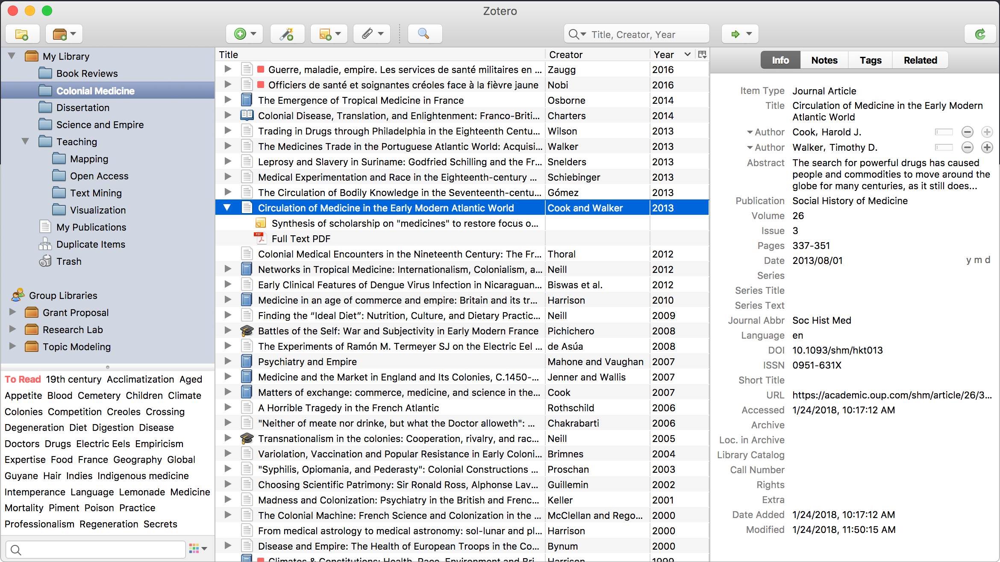
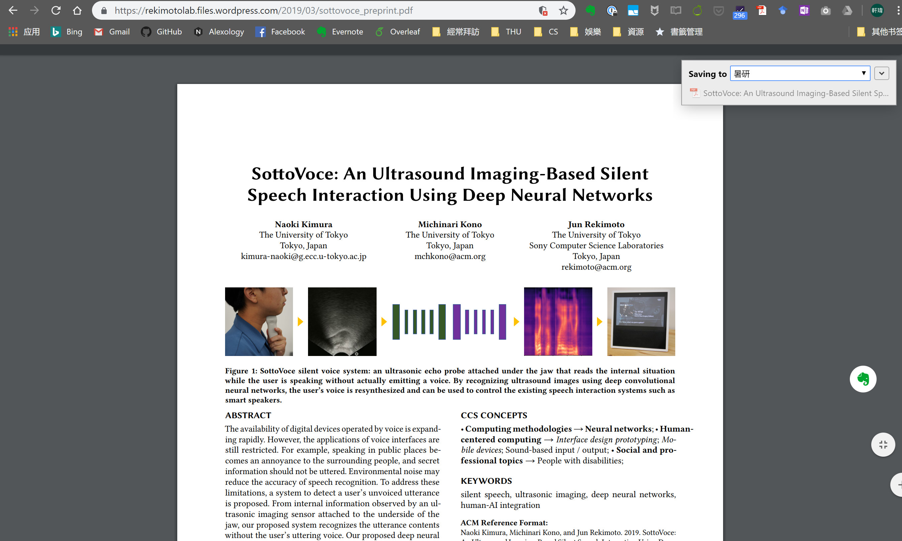
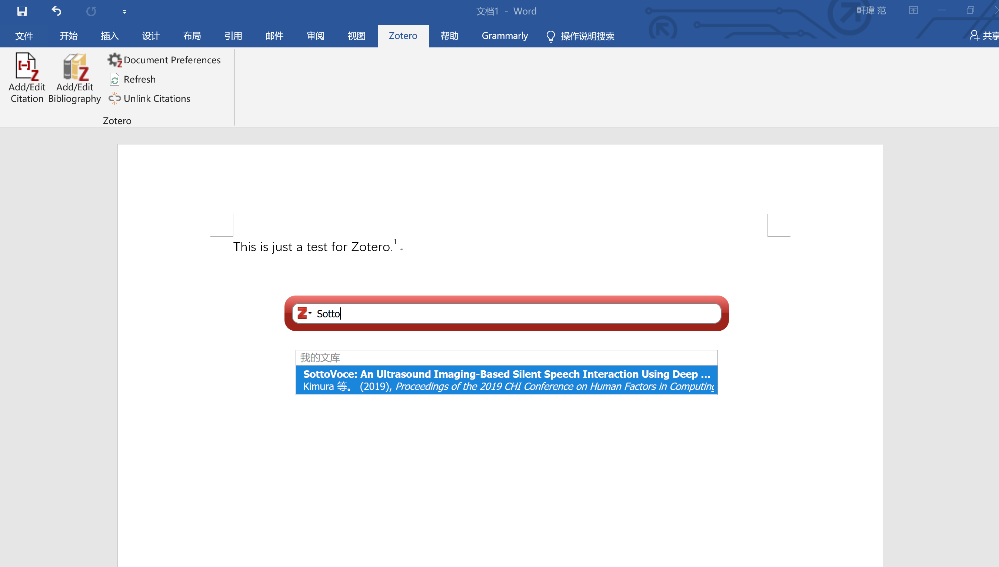
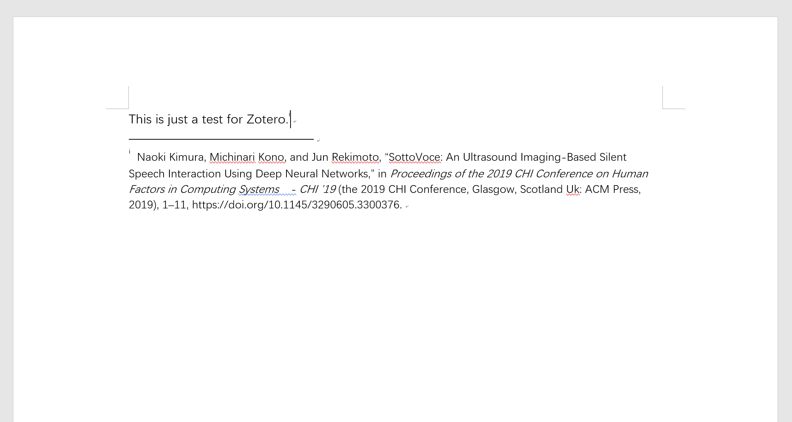
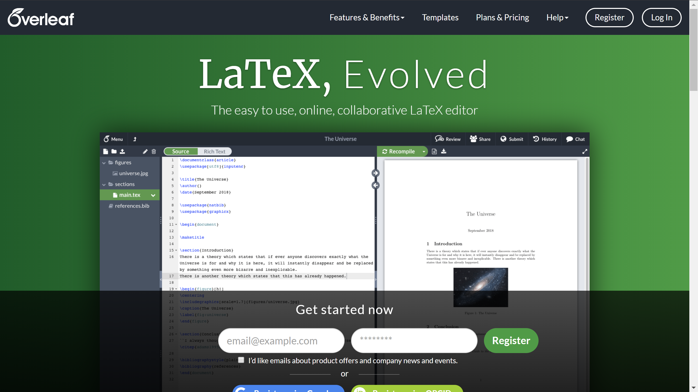
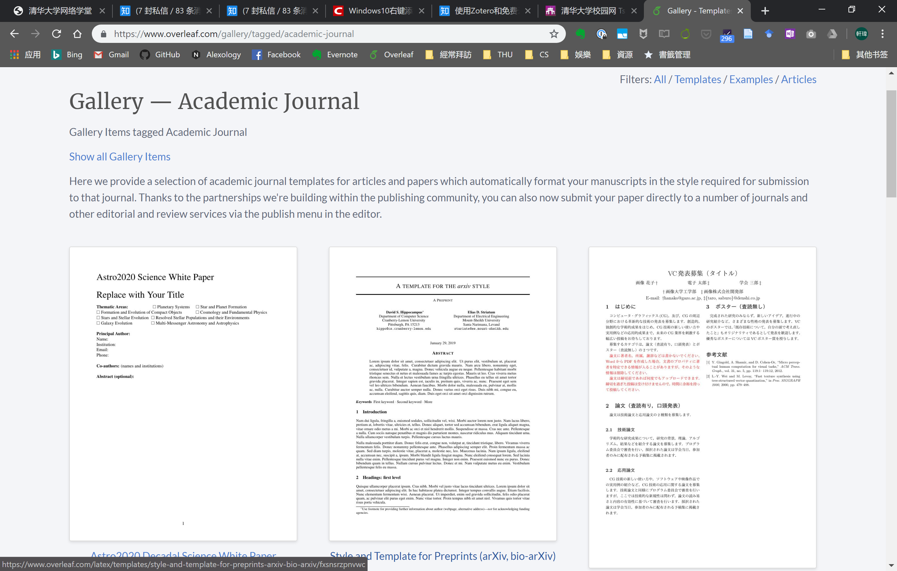
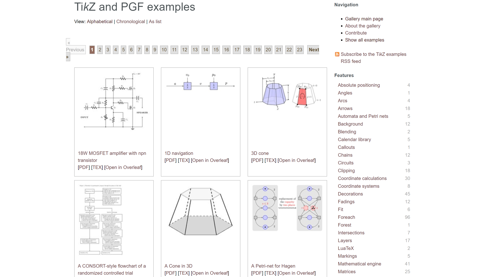

隨著進入本科高年級，許多人應該都開始了在實驗室參與科研（打雜）的生活。這篇博客將介紹一些我覺得還不錯的工具，可以一定程度地節約時間成本，讓你將心力專注在知識本身。希望對於剛開始在實驗室搬磚或是目前用土方法管理各種課程論文的你有所幫助，如果你已經有成套的研究管理工具的話繼續用自己熟悉的就好，或是也可以留言推薦一下你覺得更好的工具吸引我跳槽。

可能會不定期更新，也可能（大概率）不會。這篇博客是現在是處於連水5篇報告寫煩了又不想去做數值分析，想說不如來寫點東西更新一下的一時興起。

# Zotero：一站式的文獻管理工具

官方網站：[Zotero | Your personal research assitant](<https://www.zotero.org/>)

> Zotero is a free, easy-to-use tool to help youcollect, organize, cite, and share research.

Zotero 這個東西呢和EndNote有點像（應該有些人是用EndNote的），就是一個可以集中管理文獻的地方。我喜歡它的原因除了免費、開源、輕巧並且跨平台之外，還因為Zotero很好地完成了Click一下之後什麼都不用管的理想。辦理呢也很容易，去官網註冊一下就好，然後看個人用FireFox還是Chrome去商店裝個插件，再載個桌面程序就行。先看看他的桌面程序的樣子：

> （上圖來自Zotero官網截圖，版權屬於官網）

可以看到它像是一個論文（或是說參考資料吧）的數據庫，每一個條目裡包含了論文的各種相關信息以及其關聯的PDF文件。（官網只給了300MB同步空間，可以參考[使用Zotero和免费云存储管理文献 | 知乎](<https://zhuanlan.zhihu.com/p/26008565>)用自己的Cloud Drive存文獻，建議按照文中說的相對路徑管理PDF文件）

在知道Zotero之前（雖然也沒多長時間）我都是一個專案的相關文獻丟一個資料夾，手動下載文件，引用時手動填寫相關信息。用了Zotero後操作變成這樣：

1. Google 你要找的論文題目（或是你就是剛好看到了一篇感興趣的論文）
2. 點一下Zotero插件，存起來。

然後就完事了，之後你就會在你的Zotero裡面看到這篇文章的各種相關信息啊摘要還有文件等等，想讀論文直接點開Zotero就行。引用時的操作也簡單：

1. 引用

然後就成了，就像這樣：

> 鏈接了Zotero插件後的word，可以發現搜索到剛剛Chrome存下來的論文了。

> 尾註效果

引入之後注釋的格式是自動填充的，預設有常見會議的引用格式，如果有自己比較奇特的格式的話自定義也很容易，想想當年寫小論文自己手動輸入奇怪格式引用文獻的自己就覺得還是too young too simple。

Zotero支持Microsoft Office, Libre Office 等主流辦公軟件以及Chrome, Firefox等主流瀏覽器，優質軟件。（而且這是開源的，有能力的大佬可以Contribute一下造福我們）另外，其也支持群組功能，所以如果幾個人一起肝論文的話可以用這個共享文獻庫，大家引用時也方便得多。

哦你說誰寫論文用Office啊？當然Zotero也是支持Latex的，BibTex等各種格式都可以輸出，而且還可以直接鏈接Overleaf啊。

哦對Overleaf。

# Overleaf：在線LaTex平台

官方網站：[Overleaf](<https://www.overleaf.com/>)

> 官網截圖

這個應該也蠻多人知道的，前身好像是ShareLaTex（我就是ShareLaTex用著用著突然一天被跳轉到Overleaf）。這其實就是一個像Google Docs的在線LaTex編輯平台，還記得小學時寫報告都是大家Word拷來拷去的，版本混亂不堪又容易划水。小學高年級接觸到Google Docs之後感覺以前還是Naive（譴責一下現在團隊作業還在用USB或是微信大法的人。。）

總之如果喜歡雲端平台的人應該會喜歡這個，有些人可能喜歡本地跑自己的文件，但是即使如此依然推薦。例如我不協作時也喜歡用桌面程序寫東西，一開始碰LaTex時我也本地編譯。但是LaTex這個玩意嘛emm，配置起來真一言難盡，從Mac換Surface重配時就變成雲端黨了。Overleaf省去了各種這樣那樣配置的麻煩，畢竟LaTex核心是寫作方便不是折騰環境，所以現在感覺本地編譯可以但沒必要。何況在線協作大家也好交流，Overleaf本身又自帶一堆模板。

> 像這樣，挑一個就可以開始寫了。

不過如果還是喜歡本地跑Latex的朋友，推薦另一個好用的工具：VS Code Latex Workshop，教程見[使用VSCode编写LaTeX | 知乎](<https://zhuanlan.zhihu.com/p/38178015>)，這不只是因為我是VSCode 愛好者而是這個插件確實好用而且維護的勤。

Overleaf是可以鏈接上面提到的Zotero的，因此完全可以小組用一個Zotero群組然後寫一篇論文，引用文獻和文章本身都是在線的，省去很多溝通的麻煩我覺得。就算是單人工作，兩個結合的效果還是蠻好的。另外Overleaf也可以用GitHub管理或是Dropbox同步，這些第三方整合雖然都是訂閱版功能，但如果你是在校學生的話教育郵箱是可以直接用的。（我本來差點付錢了，後來看到教育優惠就丟了個清華郵箱）

總結而言，Overleaf的優勢在於：

1. 豐富的模板。
2. 無需折騰的配置環境，省去本地數GB的空間，一鍵切換編譯器。
3. 在線協作。
4. 和Zotero的良好整合。
5. 基於瀏覽器，這點對於iPad Pro用戶尤其友好（畢竟iOS的Word或是LaTex支持都十分孱弱）
6. 在線編譯，小白也可以很好地對照慢慢熟悉Latex。
7. 還有各種LaTex相關知識文檔等等。

如果之前沒有聽過LaTex的人，是時候去註冊個Overleaf入坑了，寫報告時不用自己調一些有的沒的間距就可以作出比Word好看得多的效果了。

## LaTex相關資源

完全不會LaTex但想了解的可以看看這個：[从零开始 LaTeX 快速入门](<http://liuchengxu.org/blog-cn/posts/quick-latex/>)

### TikZ

一個LaTex內部繪圖工具，熟悉後（其實不怎麼需要熟悉）可以很快地用代碼畫出很好看的效果圖。當然如果你更熟悉MetaPost或是其他外部繪圖工具的話沒啥必要學，出圖才是道理。教程可以看這個：[TikZ 製圖簡要教程](<http://www.latexstudio.net/archives/51453.html>)或是[Overleaf TikZ Package](<https://www.overleaf.com/learn/latex/TikZ_package>)

> 網上別人用TikZ繪製的示例圖，相關代碼都可以直接載，所以出圖很方便。

模板網站：[TikZ and PGF Examples | TeXample.net](<http://www.texample.net/tikz/examples/all/>)

# 思路整理和閱讀軟件

這邊介紹一些我有在用的生產力工具吧，這邊的其實不太算科研向工具了，畢竟各行各業都需要整理思路，剛好想到順便提一下而已。

筆記工具很多，整理思路我覺得OneNote還挺好（尤其配Surface），寫文檔推薦Typora，下面特別提一下一個冷門但還不錯的東西。

## Notion

冷門但真的強大的工具，可以做各種神奇的操作，Block的設計很好，嵌套操作尤其適合來整理、比較各種文獻方法的不同。也可以拿來當做個人Wiki, Trello, 筆記本的綜合體，不過桌面版似乎也是基於Web的，速度不是很快，然後公司不大所以其實有點擔心會不會哪天倒了。。。但並不妨礙他是個好工具啦。

官網：[Notion](https://www.notion.so)

相關介紹：

1. [Notion：重新定义数字笔记](<https://sspai.com/post/39694>)

## PDF閱讀軟件

做研究常讀論文，有個好的論文工具還是很重要的，作為一個Surface Pro和iPad Pro都用過的人，對一些我覺得還不錯的閱讀器測評一下也讓剛買的人少花點錢買不適用的軟件，由於也不算和科研很相關就簡略提過吧

### Windows 平台

#### Xodo

開啟文件快，手寫不好用，不手寫的話推薦。

#### Edge

就...預設瀏覽器，雖然看網頁不如Chrome，不過看PDF還不錯，配合Surface Pen體驗可以。

#### Drawboard PDF

手寫體驗最好（不考慮OneNote的話，畢竟OneNote的PDF支持比較奇葩），但是開啟慢，有時會Crash。Surface手寫愛好者可以考慮買，其他人推薦Xodo。

### iOS

#### PDF Expert

用過許多軟件後，我覺得iOS上體驗最好的PDF 閱讀器還是這個，Notability在閱讀器和筆記功能之間取了個Balance，這個挺純粹，不過手寫體驗沒有特別好。

#### Notability

其實也還不錯，手寫體驗佳，錄音挺不錯。對PDF要求不大的話可以考慮這個，功能多，比PDF Expert差的地方也不算很影響體驗。

------

其實像是Jupyter Notebook也很棒，但是寫起來篇幅不少現在想睡了（篇幅越寫越短hhh）。而且反正 Jupyter Notebook 知名度高大家自己應該都有在用。

之後想到可能會更新也可能咕，畢竟忙Orz 總之謝謝閱讀啦，希望有幫助。